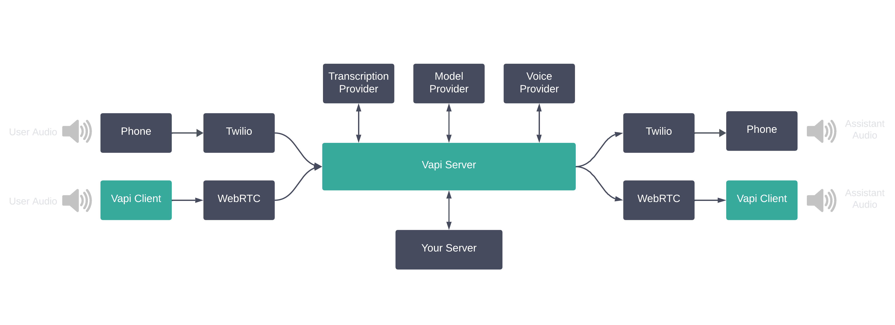
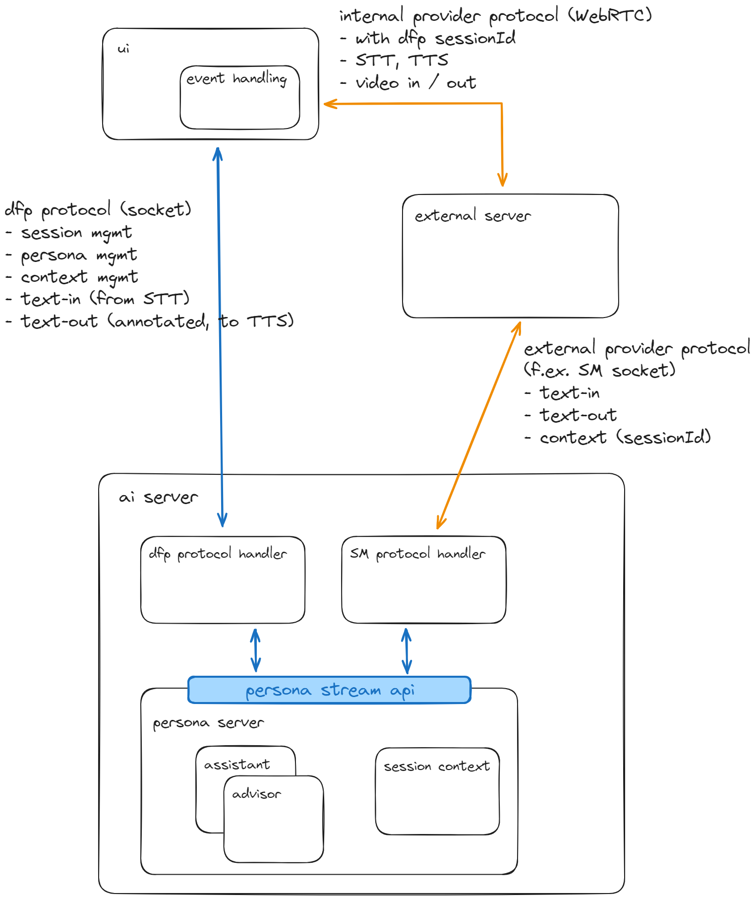

An implementation of a **Digital Human** consists of two major parts, which themselves contain different elements that model different aspects and senses:

### Avatar: Body and Senses

We call the physical representation of the digital human, the part that the customer sees and interacts with, the **avatar**.

The different elements an avatar is composed of, are the following:
- voice: conversion of brain text into voice output (**TTS**, text-to-speech)
- ears: a component that translates human utterances into a stream of text (**STT**, speech-to-text), in order to be consumed by the brain
- eyes: allows to see the customers non-verbal communication, mood, signs, etc
- body: a visual rendering of a digital humans body or parts thereof (head and shoulder)

### Persona: Brain

The **persona** is the intangible thinking part of the digital human, conversational, text input to text output.
- "text-based brain": to some extent, the brain is based on an LLM, at the very least to classify and "understand" human utterances, in order to drive more deterministic "thoughts", and generate answers as a reaction
- the brain itself will most likely need be constructed out of different parts, f.ex.

	1. a context provider, a tool that fills in the blanks with context of the conversation, f.ex. **"it"** in a request like "tell me more about it"
	2. a classification element, which classifies a users intent in order to direct a question to a slower but more precise thinking part (which could be another LLM or the application server)
	3. possibly different watchdogs, to make sure that the conversation is still on track and following an expected route
	4. one or more slower, but more accurate thinking elements (for the parts where we cannot rely on the approximative nature of LLM)

- on the _application server_ side, this might entail engines like a workflow or rule engine, to guide and keep longer lasting conversations on track

### Discussion

While these components above are to some extent independent from one another, in practice SaaS providers bundle and offer them together in some way.

Examples for Avatar providers:
- **Soulmachine** offers a complete video-streamed avatar, with a TTS and STT component as well as eyes to convey emotions, with good exit points to connect a custom brain
- **vapi.ai** offers a similar package but only voice-based, neither body nor eyes, with an ok exit point to connect a custom brain
- **Sindarin.tech** again offers a voice-based package, neither body nor eyes, with a toolkit to build a custom brain, which does not yet seem to be customised like the other two
- there are libraries and solutions to build a WebGL-based body / face lipsyncing to to-be-spoken text, but this technology does not pass the uncanny valley yet

So unfortunatly, as of now (March 2024), there are no clear winners yet in neither technology aspects or from the providers side. So for us it will be very much a "buy vs make" decision on almost every element.

As of now (March 2024), these components have different maturity levels:
- TTS, STT are pretty mature, Azure and others provide reasonably priced and acurate services. however, there are still challenges to make voicebots a good experience, f.ex. latency, silence detection, possibility to interrupt, etc
- eyes: unclear, Soulmachine provides some basic elements of emotion detection, but does not help with detection of whether a person is still formulating / thinking about his input
- natural conversational flow of speech needs a combination of these 3 parts, in order to detect whether a person is still thinking and formulating his thoughts, but also provide a low latency for answer generation
- body: different technologies are still competing:
  WebGL rendered on the user device, video-streamed avatar, upcoming instant video diffusion models.
	the body represenation must be quite good, in order to avoid the "uncanny valley" effect of a sub-par representation.
	Soulmachine video-streamed avatar looks quite good already, WebGL solutions are still somewhat creepy.

### Current Position (March 2024)
- we are focusing on voice-only-based conversations (**voicebot**)
- there are still some challenges in voice conversations which should be tackled first before going into the physical body representation (low latency vs knowing that a person stopped speaking, ability of a digital human to still listen / be receptive to non-verbal communication while speaking)
- the physical body representation is neither technologically mature nor uncanny enough to be used as of now
- we will reconsider the state of the market for body representation at the end of the year (provided we are successful with the voice conversation)

### Market Overview (March 2024)
- TTS, STT: Azure AI Speech (has swiss german), OpenAI Whisper (STT), Elevenlabs (TTS), Sindarin (conversational flow tbd, but english only), deepgram
- LLM: OpenAI ChatGPT, Anthropic Claude (not available in EU), Mixtral
- LLM Provider: for open-source models there are different providers already: groq (super fast, Mixtral, ...)
- eyes: Soulmachine, Google Lab for Body Language (in the browser)
- conversation flow: Sindarin (english only, no custom brain?)
- body: _Video Streaming_: Soulmachine, d-id; _WebGL_: Open Source libraries with three.js; _Instant Video Diffusion_: not yet available

### AI Server (aka Orchestration Server)

In order to connect Body & Brain, we need to build a so-called **orchestration server** which we call our **ai server**.

The ai server connects the different streams from and to the different elements of the digital human. As with the technology itself, the industry has not yet converged into one technical architecture, so we need to come up with a solution that is flexible enough to be able to connect different elements of different providers, and to be able to switch out elements as the technology matures.

We have currently encountered two different architectural approaches:
- UI focused, this is our DIY approach, where we directly connect from the UI to f.ex. STT/TTS of Azure AI Speech, get back the text, and send it directly to our ai server for processing.
- Server focused, where a third-party avatar provider keeps their logic on their server, and allows a connection to our orchestration server to run our custom brain (f.ex. SoulMachine, vapi.ai)

The following diagram shows the vapi.ai architecture, where "your server" is our ai / orchestration server. This is the same setup as for SoulMachines:

#### AI Server Architecture

In order to support both approaches, and to shield our ai server communication protocol from vendor specific dependencies, we will provide a streaming api on our ai server, to which the different (typically socket-based) consumers can connect. This streaming api will be the only point of contact to the different elements. It will also host the different personas as well as their session state within.

The **dfp-protocol** has 2 parts, one is mandatory, the other is optional, depending on the avatar provider.
- mandatory: session-, persona- & context-management
- session-management: opening and closing of sessions, setting session user, getting sessionId, etc
- persona-management: starting and switching personas, providing persona-specific context, etc
- context-management: setting and getting session- and persona-specific context, f.ex. the current tabs of the session user
- optional: chat-management: if we do our DIY TTS/STT on the client, we send the text-input from STT to the brain and receive annotated text-output to TTS from the brain via the dfp-socket as well

#### Persona Streaming API

A persona is exposed through a streaming API, which means that it can receive messages and produce an resulting stream of messages during processing of the incoming message.
F.ex. it could emit a "wait a second" message when it encounters that some more work needs to be done, before the final answer.
Technically, the streaming API is tbd, since nodejs does not provide a very nice abstraction.
It could very well be a simple async function with a callback function as event emitter.

Anyway, this streaming API allows to seamlessly connect incoming socket connections.

__Session management__

A session corresponds to a socket connection from the UI.
Since we must coordinate between the dfp-socket and potential provider specific connections (f.ex. SoulMachine custom orchestrator socket), we need to have a server-side session management.
Basically it provides a sessionId (as correlation id for the provider connections), keeps userInfo and provides session-specific storage for persona and context data.

__Persona management__

Personas "live" on the ai server, they are started and/or switched to by the UI.
In the end, there probably should only be two personas, assistant for the expert user, and advisor for the customer, which could have internal context switches, f.ex. btw assistant and tutor.
A persona may be implemented in any way which is applicable, but most likely it will be more than just one call to the LLM with a specific system prompt.
So it needs to manage its own state within the session.

__Context management__

If a persona has context, it can store and access it per session.
This context could be provided from the UI (f.ex. the current list of household, or the tabs a user has currently access to), in later phases it could also be provided by the application server directly.

__Chat management__

The actual persona business, handling a sequence of messages between the user and the brain.
Persona responses are annotated text messages, annotations are embedded into the text stream according to SoulMachine conventions, f.ex. to indicate a pause, or to indicate that the persona is still thinking, a card should be shown.
They might need to be adapted to the specific TTS provider, which can be done on the UI (in the event handling part, or on the server, with a provider-specific adapter after the dfp protocol handler).
