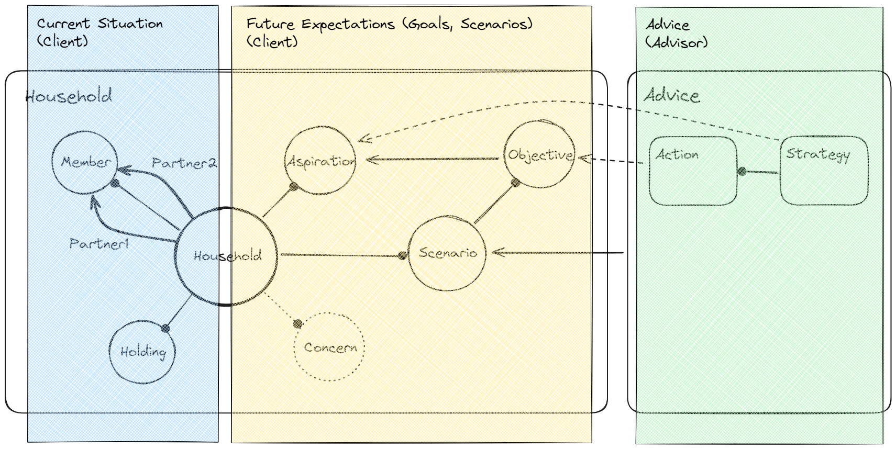
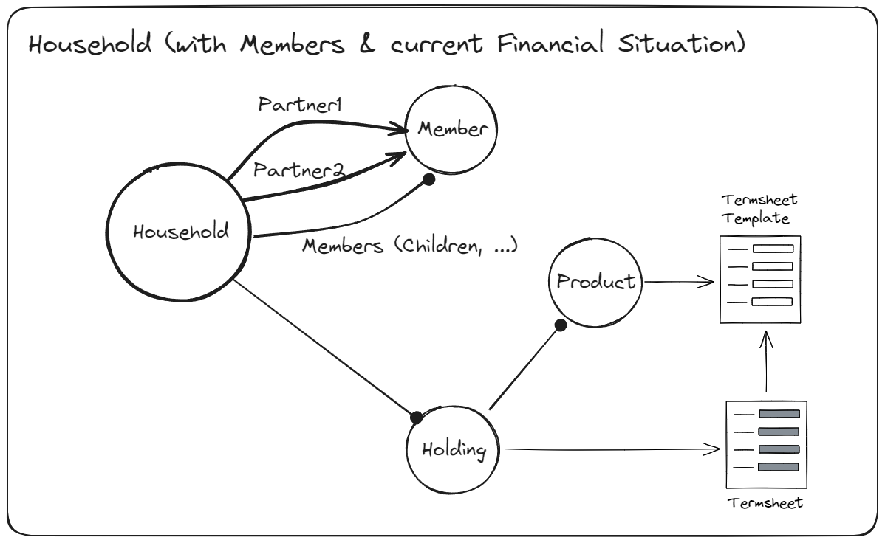
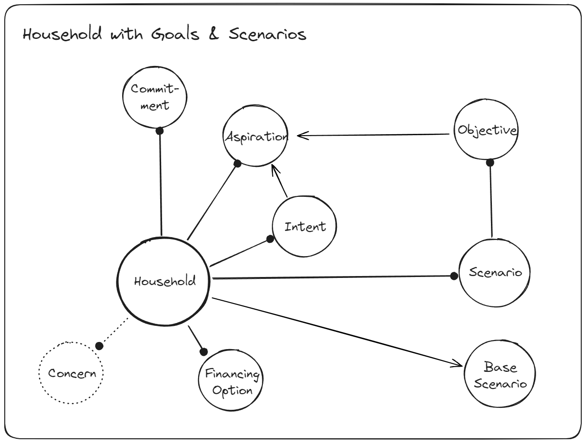

This document describes the **Domain Model** of the dfp application server.
In addition to just handling the domain of **financial planning** itself, we need to capture all the semantics around **Onboarding** a client through an **AI chatbot**.
So the domain model is a bit more complex than just the financial planning domain, since we need to capture a clients nuanced intentions through the Onboarding process.

The following image shows a high-level view of the different entities and their relationships.

We can identify three main areas:
* **Current situation** of the Household, with Members and the current financial situation (which +/- corresponds to the tax declaration + provision contracts)
* **Future expectations** with Aspirations, Scenarios and Objectives of the Household
* **Advice** from the Financial Advisor, which is the result of the financial planning process in response to the sitation of the Household

## Household and current financial situation (Object)

The **Household** is the main entity of the domain model.
It consists of one or more **Members** that are bound to and / or affected by a common financial environment.
The current financial sitation is kept in so-called **Holdings**, which are roughly the things you have to state in your tax declaration, but also include retirement provisions (AHV, BVG, 3a etc).

#### Basic Houshold information

There is some basic financial planning relevant information on the Household itself:
- [x] Tax domicile
- [x] Civil status
- [ ] ~~Matrimonial property regime (Güterstand)~~

#### Civil Status
- [x] Single (a single person)
- [x] Married (a married couple)
- [x] Registered Partnership
- [ ] Cohabitation [Konkubinat] (a couple living together without being married)

### Member

A **Member** is a person that is a member of the **Household**.

There is always a primary Member (Partner 1) of the Household, for married couples and registered partnerships there also is a secondary Member (Partner 2).
Additionally, other Members in the Household are typically dependents and/or children.

### Holding (current financial situation)

The current financial situation of the Household is kept in so-called **Holdings**, which contain
- **Financial Assets** (f.ex. Bank Accounts, Investment Portfolios)
- **Real Assets** (f.ex. Real Estate, Tangible Assets like Cars etc)
- **Liabilities** (f.ex. Mortgages, Loans)
- **Flows**, incoming and outgoing (f.ex. Salary, Rent, Alimony, Rental Income etc)

The current financial situation also includes contractual obligations like interest payments or redemptions of Mortgages.

The structure of the Holdings is defined by the **Product** that is used to instantiate the Holding.

### Product

A Product is like an Asset or Financial Instrument in a Securities Portfolio, but in includes a broader set of "instruments", both financial instruments as well as real assets.

The **Product**
- defines the attributes that need to be defined in order to personalise it for a specific holding (f.ex. the amount and interest rate of a mortgage) through a corresponding **Termsheet Template**, whose attributes are filled with the actual values in the **Termsheet** of the Holding.
- drives the **Projection** calculation of the holding (f.ex. an Investment will be projected with a certain return rate)

## Household and future expectations

### Goal

A financially relevent goal of the household or its members.

Goals can be quite vague (f.ex. "optimise my retirement situation") or very specific (f.ex. "I want to buy a house in Weiningen in Q4 2024 for 1M CHF"). We model them both as goals, but with the distinction between
- Aspiration (vague)
- Objective (specific)

### Concern

Financially relevant concerns of the household or its members.

Concerns can be explicitly stated or implicitly derived from the goals or the situation of the household.

### Scenario

A scenario is one mutual exclusive path into the future of the household.
There is always one default scenario for a household.

Explicitly or implicitly, through goals, a household can define multiple scenarios (f.ex. "what happens if we move together").
These goals are characterised by being mutually exclusive to other goals, i.e. they are not subject to an optimisation.

A scenario can therefore define its own set of goals (and maybe concerns).

## Advice (Order)

An advice is the answer of a financial planner to a household scenario.

One advice targets exactly one scenario.
There could be multiple advices (versions) for one scenario, in order to elaborate different solutions.
In order to address the feasability or optimisation of a scenario, an advice can define strategies and actions.
Each advice has its own worflow (every version of advice for a specific scenario can be dismissid or elaborated separatly).

### Action (docPart)

An action is a concrete step that should / can be taken in order to address a concern or goal.

An action may be specific to a certain goal.
An action is proposed by a financial planner and can be accepted or rejected by the household.
Actions may be grouped into strategies (TBD).

### Strategy (docPart)

A strategy (used as per the CFP terminology) is a subset of a financial plan, that is designed to adress either a specific area (retirement planning, risk reduction, ...) and/or a goal (probably rather aspirations than objectives).

## Interplay between Goals and Strategies/Actions

### Aspiration (the Why)

Aspiration represents the broad, qualitative vision or overarching desires an individual has regarding their financial future.
It's about the fundamental reasons behind wanting to manage and improve one's financial situation.
Examples might include "achieving financial independence," "ensuring a comfortable retirement," or "providing for my family's future."
Aspirations are the motivational foundation upon which more concrete plans are built.

### Objective (the What)

Objective refers to specific, measurable goals that support and are inspired by the client's aspirations (which may or may not be explicitly stated).
Objectives are clear, quantifiable targets that serve as milestones on the path to realizing aspirations.
They include details such as amounts, timelines, and other criteria that allow for tracking progress.
For example, "save $1 million for retirement by age 65" or "purchase a home worth $400,000 in five years."

### Strategy (the How - Broad Approach)

Strategy outlines the broad approach or methodologies to be employed to achieve the objectives, thereby fulfilling the client's aspirations.
It includes the rationale for selecting certain paths over others and is informed by an understanding of the client's current financial situation, risk tolerance, time horizon, and other personal factors.
A strategy might involve "utilizing tax-advantaged accounts to maximize retirement savings" or "diversifying investments to balance growth and risk."
It sets the direction for the specific actions to be taken.

### Actions (the How - Specific Steps)

Actions are the specific, actionable steps that need to be taken to implement the strategy.
These are the concrete tasks or decisions that the client, often with the advisor's guidance, needs to execute.
Actions turn the strategy into reality and are directly aimed at achieving the set objectives.
Following the strategy of utilizing tax-advantaged accounts, actions could include "contribute $19,500 annually to a 401(k) plan," "open a Roth IRA and contribute the maximum allowable amount," or "rebalance the investment portfolio annually to maintain the desired asset allocation."

In this framework:

Aspirations give rise to Objectives, which define what needs to be achieved in clear terms (but not every Aspiration needs to be detailed as Objectives, they might remain vague from a customer perspective).
Strategies provide a broad approach on how to achieve these goals (aspirations and objectives), considering the client's entire financial picture and personal preferences.
Actions break down the strategy into specific steps, detailing exactly what will be done to move towards the goals.

## Product (obj)

A generalised financial product, or rather a product with financial planning impact.

### Termsheet (property)

## Document (obj)

A fincial planning relevant document.
