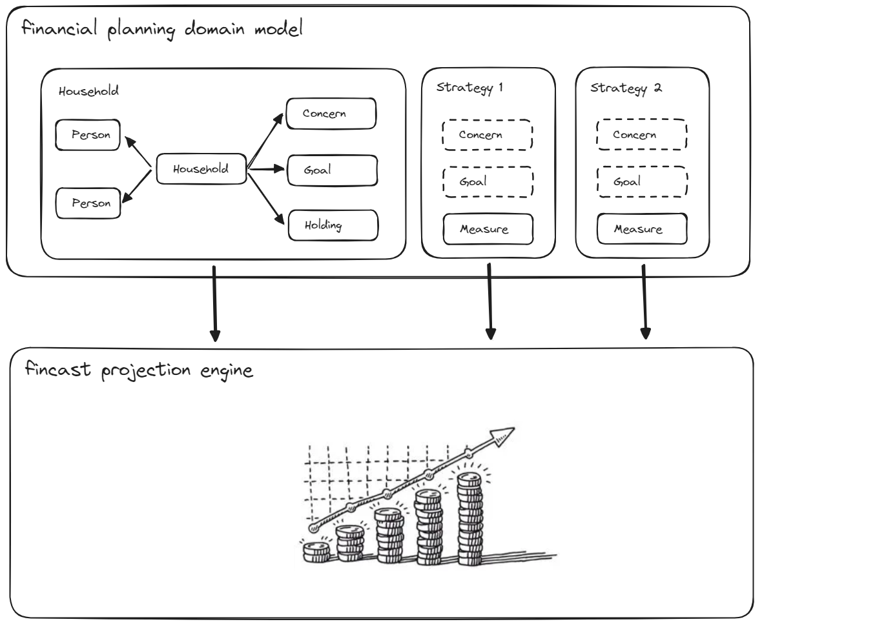
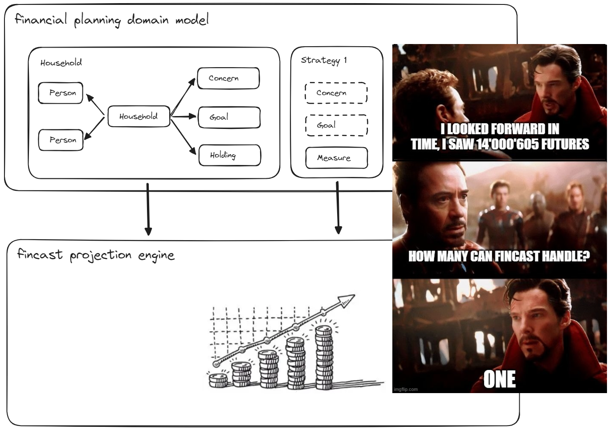
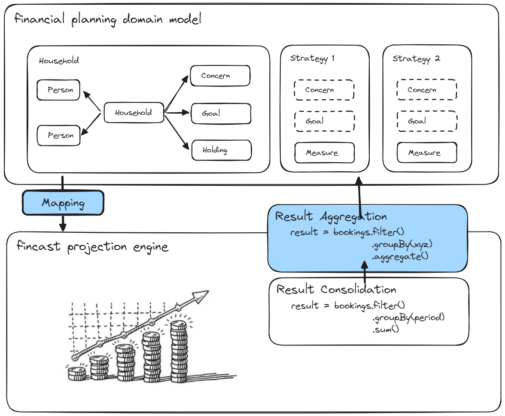
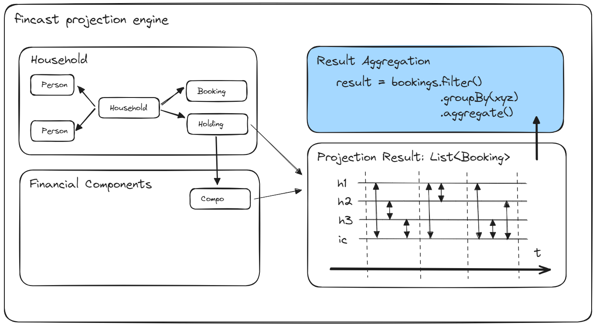

## Some principles
* core engine must be as "context free" as sensible (dont pollute it with taxes, reports specifics, etc)
* so handle jurisdiction and application specifics as much as possible outside of core engine (this however is of course not a black and white topic)
* on the consumer side, we want to be flexible in terms of what we can model, and to some extend also how we want to model it (which implies that the core engine must support simple but flexible building blocks to accomodate)
* only model the minimal set of __structurally__ different products. f.ex. we want to avoid to model an investment account differently than a swiss pillar 3a portfolio, structurally they are the same, differ only in tax treatement.
* instead of building a complex metadata model to drive the mapping between consumer and fincast model, we accept explicit coding as a tradeoff (there is only one consumer at the moment)

## Basics: Time and Money resolution

* __SimDate__ provides for a monthly time resolution
* Amount are kept as __doubles__, we are not doing bookkeeping to the cent


## Layering (domain model vs fincast)

The domain model and fincast have different purposes and therefore different structures:
* __finplan domain model__: model of __all potential futures__ (holdings, goals, concerns, scenarios, measures, ...)
* __fincast__: model of __exactly one future__ (household, person + holdings, irrespective if holding, goal, concern, measure)

Examples:

| __domain model__ | __fincast__ |
| --- | --- |
| __goal__: potential early retirement | retire early at 63 |
| __goal__: buy a yacht in around 4 years, for about 200k | buy a yacht in 2028 for 150k |
| __concern__: health care costs | dental bill of 25k in 2027 |
| __measure__: phased payout pillars 3a | in 2036 payout of 2nd 3a account |



## Mapping: domain model -> fincast household -> financial components

* fincast does not know about all the complexities of the domain model, neither __structurally__ (no need to distinguish between a goal or a contractual commitment) nor about __optionalities__ (options have to be fixed when projecting)
* to bridge the gap we need a __mapping__ from domain model to fincast
* as a consequence, the fincast __product model__ can be kept rather simple and generic since the rich finplan domain model is dumbed down through mapping
* for the mapping, instead of building a complex metadata model to guide the mapping we accept explicitly coded mapping as a tradeoff




## Household Structure
* Household
* Person (partner1 and optional partner2)
* Dependent (children) [nyi]
* Holding (no product entity)
* Cashflows & Transfers (discretionary bookings, f.ex. through goals and measures)


## Holding Granularity

The holding granularity for projection is a mixture of what is mandated by fincast and domain model convention:

__Dedicated holdings__ (bank account or investments, anything is possible acctually)

* regulated, personal retirement provision products (AHV, BVG, 1e, 3a) with individual cashflow schemes
* large and/or illiquid assets (real estate) or liabilities (mortgage)
* __bucket Holdings__: holdings that for various (client mandated) reasons need to be tracked separately.
typically linked to a specific goal, concern or measure.

__Special (summary) Holdings__

* __external Cash__ (mandated and created by __fincast__): placeholder for all external cash holdings
* __internal Cash__ (mandated by __fincast__): aggregation of non-bucket bank accounts
* __buffer Investment__: analoguos to internal cash, sum of all non-bucket investments. it is used to buffer excess cash. they cover for years with negative cashflow and are topped up through positive cashflows (subject to the household targetCashBalance).


## Products / Holdings

Currently fincast supports the following __Product / Holding Catalog__

* _Valuable_ (holdings that have a - positive or negative - value)
	* __Bank Account__ (checking, savings, CH vested benefits account)
	* _Asset_ (positive value)
		* _Financial Asset_
			* __Investment__ (with contribution plan, cash/bond/stock part, withdrawal plan)
			* __ChPillarTwoCapital__ (*)
		* _Real Asset_
			* __RealEstate__
			* __TangibleAsset__ (depreciating, appreciating)
	* _Liability_ (negative value)
		* __Liability__
* _Contract_ (holdings that only generate value flows)
	* __Income__ (salary, rental income, ...)
	* __Expense__ (rent, alimony, ...)
	* __Transfer__ (internal transfer between holdings, f.ex. from internalCash to 3a account)
	* _Swiss Retirement Product_
		* __ChPillarOne__
		* __ChPillarTwoPension__ (*)
	* _Swiss Taxes_
		* __ChTax__

(*) need to be reconsidered, might be Investment as well.


## Projection Result: Bookings

The result of a projection run in fincast is a __reactive flow__ of consolidated half-bookings (see below), with complete information about counter and
triggering holding and financial component.

```kotlin
data class Booking.Lifecycle(
  val holding: Holding,
  val date: SimDate,
  val bookingKind: BookingKind,
  val amount: Double,
  val counterHolding: Holding,
  val trigHolding: Holding,
  val trigCompo: String,
)
```

For example, a salary (income) holding will trigger monthly bookings from externalCash to internalCash with trigger holding salary.


## Booking Consolidation & Result Aggregation

The aggregation process is split into 2 phases:
* Booking Consolidation (fincast)
* Result Aggregation (domain model)




## Booking Consolidation (fincast)

Consolidation describes the compression of detail bookings per projection period. So if the projection period is yearly, f.ex. all the monthly salary bookings are consolidated into one yearly salary booking.

Note that even if the required time resolution is yearly, the projection engine still works with monthly time steps.


## Result Aggregation (finplan consumer)

Since the preliminary result of the projection engine is just a list of consolidated half-bookings, we typically need to aggregate them on holding and household level to get a useful result.
Aggregation rules are typically defined via domain model concepts, which are not and should not be known to fincast (f.ex. group by "liquidityClass").
Therefore aggregation is not part of the core engine and must be done by the consumer.

Of course, we cannot aggregate more details than we have in the bookings, so we need to make sure that the bookings are detailed enough to support the reports we want to generate.


## Projection Listeners

The engine offers its results, the bookings, through listener interface `ProjectionListener` one by one as they are created.
When the "booking engine" creates a new booking, it will notify all registered booking listeners.

```kotlin
interface ProjectionListener {
  fun onStartOfMonth(date: SimDate) {}
  fun onBooking(booking: Booking) {}
  fun onEndOfMonth(date: SimDate) {}
}
```

Listeners can then do internal calculations, f.ex. do an accumulation over the running year of what salary or pillar 3a payments have occured.

F.ex. the ChTax holding is also a `ProjectionListener` (see below for an excerpt).


## Taxes

Since we postulate that we only want to model __structurally__ different products, we need to find a way to differentiate between different tax treatments of holdings. How do we now differentiate between an investment account and a pillar 3a account for tax purposes?

Enter `Holding.taxCode: String`.

We can tag holdings with simple tax codes (string), and the tax engine can then use these codes to apply different tax rules.
It is the mapping's responsibility to make sure that the tax codes are set correctly.

As an example see the following excerpt from `ChTax` projection listener, which aggregates tax relevant bookings for the household through the year:

```kotlin
// Income Tax Aggregation
override fun onBooking(booking: Booking) {
  ...
  // DEDUCTABLE EXPENSES
  if (holding == household.externalCash && amount > 0) {
    if (trigHolding is RealEstate) {
      taxAggregation.hhBuildingMaintenanceCosts += amount
    } else if (trigHolding is Expense && trigHolding.hasTaxCode(ExpenseRent)) {
      taxAggregation.hhRentalExpense += amount
    } else if (bookingKind == BookingKind.INTEREST) {
      taxAggregation.hhDebtInterest += amount
    }
  }
  ...
}
```

Currently supported tax codes from `ChTax` are:
* SalaryPrimary (ESTV detail, triggers primary deductions)
* SalarySecondary (ESTV detail, triggers secondary deductions)
* ExpenseRent (deduction)
* ExpenseAlimonyMinor (deduction)
* ExpenseAlimonyAdult (deduction)
* Investment3a (deduction)


## Projection Lifecycle & Yearly Rebalancing

In order to get to a meaningful projection, we need to handle rebalancings between holdings on a periodic (yearly, actually) basis.
Before we go into the details, let's have a look at the general projection lifecycle.

1. Holding Lifecycle (cashflow, interest, dividends, ...)
2. End-of-month Transfer (f.ex. "transfer 100% of 3a Account to internal cash", "pay due taxes from 2 years ago")
3. EOY Taxes
4. EOY Rebalancing

We need to differentiate between the normal, monthly holding lifecycle and end-of-month transfers, because the latter, when defined in a relative way, need to be based on the final end-of-month balance after all lifecycle bookings have been processed (f.ex. "transfer 100% of 3a account to internal cash").

Note that end-of-month transfers also include discretionary (i.e. user defined) and unconditional transfers or cashflows, f.ex. "buy a house in 2028 for 200k", "transfer my yearly pillar 3a contribution", "pay my taxes from 2 years ago".

### EOY Rebalancing Algorithm

After all the bookings in a year have been processed, including taxes, we can approach the EOY rebalancing, based on the household targetCashBalance.

__Profit Distribution__

If we have more internalCash than the targetCashBalance, it means we have made a profit in the year.

We can distribute the surplus to other holdings, according to rules, f.ex.
* "10%, capped by yearly max, to my 3a account"
* "up to CHF 5'000 to my Whisky collection"
* "up to CHF 10'000 to my bucket investment"

If there is anything left after distribution, we will top up the buffer investment.

In this scenario, the internalCash balance at the end of the year will be at the targetCashBalance.

__Loss Coverage__

If at the end of the year, we have less internalCash than the targetCashBalance, it means we have made a loss in the year.

We will cover the loss from the buffer investment, to again reach the targetCashBalance.
As long as there are enough funds on the buffer investment, that works well.
Once buffer investment goes to zero, internalCash will drop below targetCashBalance, and might even drop below zero.

Balance of internalCash going below targetCashBalance or even zero is a very simple indicator if a financial plan is working.


## Various Topics

### Financial Components

Financial lifecycle is covered by a set of simple building blocks within a holding, called __Financial Components__.
* __InterestCompo__ (calculate and book interest)
* __DividendCompo__ (calculate and book dividend yield)
* __CapitalGainCompo__ (calculate and book capital gains)
* __CashflowCompo__ (generate incoming or outgoing cashflow bookings)
* __TransferCompo__ (generate household-internal transfers, f.ex. from internalCash to 3a account)




### Configuration: Kotlin embedded DSL

Kotlin provides a nice function surface to implment embedded DSLs. Their readability is good enough, so that we can use them to configure the finplan domain model.

Example: __Termsheet__

```kotlin
Termsheet(tme, "real_estate") {
  name = "Real estate"
  term("fiscalValue") { type = "value"; name = "Fiscal Value" }
  term("imputedRentalValue") { type = "value"; name = "Imputed Rental Value" }
  term("isSelfOccupied") { type = "boolean"; name = "Is self occupied?" }
  term("rentalIncome") { type = "value"; name = "Rental Income (yearly)" }
  term("maintenanceRate") { type = "percentage"; name = "Maintenance Rate" }
}
```

Example: __Product__

```kotlin
Product("ch_pillar_3a_account") {
  name = "Säule 3a Konto"
  description = "Säule 3a Konto"
  productModel = "investment"
  liquidityClass = "retirement"
  term("contributionPeriodicity") { value = "yearly"; +frozen; +hidden }
  term("cash") { value = "100"; +hidden }
  term("cashInterestRate") { value = "2" }
  term("bond") { value = "0"; +hidden }
  term("bondInterestRate") { +hidden }
  term("stock") { value = "0"; +hidden }
  term("stockDividendYield") { +hidden }
  term("stockCapitalGain") { +hidden }
  term("managementFee") { value = "0"; +hidden }
  term("performanceFee") { value = "0"; +hidden }
}
```


## Work in Progress

* finplan: Domain Model with Goals, Concerns, Strategies, Measures, ...
* Inflation
* Products in Detail (subject to detailed business analysis)
